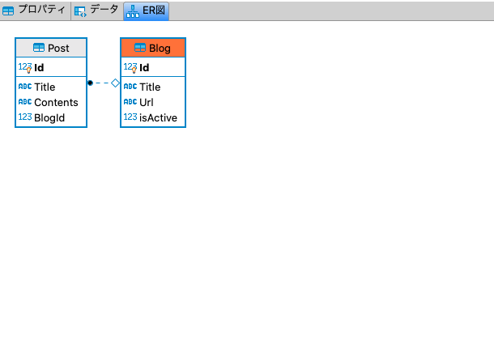
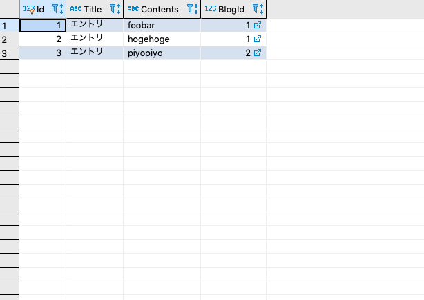

EntityFrameworkCoreRelationSample
====
- EntityFrameworkSampleと同じ手順で、プロジェクトを作成し、SQLiteデータベースへのアクセスとマイグレーションができるようパッケージを作成。

```sh
$dotnet new webapi EntityFrameworkCoreRelationSample
$dotnet sln add EntityFrameworkCoreRelationSample
$cd EntityFrameworkCoreRelationSample
$dotnet add package Microsoft.EntityFrameworkCore.SQLite    
$dotnet add package Microsoft.EntityFrameworkCore.Design 
```

[EntityFrameworkのリレーションシップ](https://docs.microsoft.com/ja-jp/ef/core/modeling/relationships?tabs=fluent-api%2Cfluent-api-simple-key%2Csimple-key)のページを参考に、Modelを作成する
- 親側にリレーションが定義されていれば、EntityFrameworkが自動検出してリレーションシップを自動生成する

__【Models/Blog.cs】__
```cs
using System.Collections.Generic;
using Microsoft.EntityFrameworkCore;

namespace EntityFrameworkCoreRelationSample.Models
{
    /// <summary>
    /// Blogエンティティ
    /// </summary>
    public class Blog
    {
        /// <summary>
        /// Id
        /// </summary>
        /// <value></value>
        public int Id { get; set; }

        /// <summary>
        /// Title
        /// </summary>
        /// <value></value>
        public string Title { get; set; }
        
        /// <summary>
        /// URL
        /// </summary>
        /// <value></value>
        public string Url { get; set; }

        /// <summary>
        /// isActive
        /// </summary>
        /// <value></value>
        public bool isActive { get; set; }

        /// <summary>
        /// Posts 
        /// </summary>
        /// <value></value>
        public List<Post> Posts { get; set; }

    }
}
```

__【Models/Post.cs】__
```cs
using System.Collections.Generic;
using Microsoft.EntityFrameworkCore;

namespace EntityFrameworkCoreRelationSample.Models
{
    /// <summary>
    /// Postエンティティ
    /// </summary>
    public class Post
    {
        /// <summary>
        /// Id
        /// </summary>
        /// <value></value>
        public int Id { get; set; }

        /// <summary>
        /// Title
        /// </summary>
        /// <value></value>
        public string Title { get; set; }
        
        /// <summary>
        /// Content
        /// </summary>
        /// <value></value>
        public string Contents { get; set; }

        /// <summary>
        /// Blog 
        /// </summary>
        /// <value></value>
        public Blog Blog { get; set; }

    }
}
```

- BlogとPostのエンティティをもつDbContext`BlogContext`を作成する。

__【Models/BlogContext.cs】__
```cs
using Microsoft.EntityFrameworkCore;

namespace EntityFrameworkCoreRelationSample.Models
{   

    /// <summary>
    /// BlogContext
    /// </summary>
    public class BlogContext: DbContext
    {
        /// <summary>
        /// コンストラクタ
        /// </summary>
        /// <param name="options"></param>
        public BlogContext(DbContextOptions<BlogContext> options)
            :   base(options) 
        {

        }

        ///<summary>
        /// モデル生成時に呼ばれるライフサイクルメソッド
        ///</summary>
        ///<param name="modelBuilder"></param>
        protected override void OnModelCreating(ModelBuilder modelBuilder)
        {
            // データのシードを定義
            modelBuilder.Entity<Blog>().HasData(
                new {Id = 1, Title="ブログ村1", Url="https://xxx.yyy.zzz", isActive=true, },
                new {Id = 2, Title="ブログ村2", Url="https://aaa.bbb.ccc", isActive=true, },
                new {Id = 3, Title="ブログ村3", Url="https://ddd.eee.fff", isActive=false, }
            );

            modelBuilder.Entity<Post>().HasData(
                new {Id = 1, Title="エントリ", Contents="foobar", BlogId=1, },
                new {Id = 2, Title="エントリ", Contents="hogehoge", BlogId=1, },
                new {Id = 3, Title="エントリ", Contents="piyopiyo", BlogId=2, }
            );
            
        }

        /// <summary>
        /// DbSet
        /// </summary>
        /// <value></value>
        public DbSet<Blog> Blog {get; set;}

        /// <summary>
        /// DbSet
        /// </summary>
        /// <value></value>
        public DbSet<Post> Post {get; set;}
    }   
}
```

- マイグレーションを実行して、データベースを生成する。

```sh
$dotnet ef migrations add InitialCreate  
$dotnet ef database update 
```

- 生成されたSQLiteのデータベースファイルにクライアントから接続して表示するとリレーションとデータが生成されていることが確認できる。






- BlogControllerを作成して、`Blog`と`Posts`をJoinしてデータを取ってくるようにする
- Join句はLinqで書けるので今回はLinqで書いた
  - データベースの取得結果の匿名構造体をインタフェースに書くのが面倒だったのでdynamicを指定しているがきちんとinterfaceを書くべきだと思われる。

```cs
[HttpGet]
public IEnumerable<dynamic> Get()
{
    var lists = from blog in _context.Blog
                join post in _context.Post
                on blog.Id equals post.BlogId into temp
                from selects in temp.DefaultIfEmpty()
                select new
                {
                    BlogId = blog.Id,
                    PostId = selects.Id,
                    Contents = selects.Contents
                };

    return lists;
}
```

