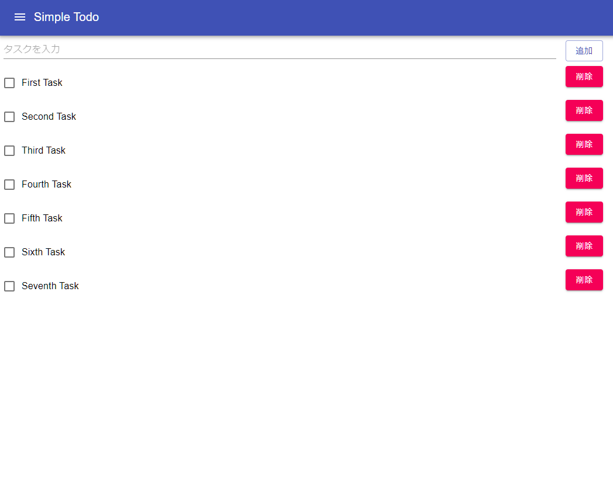
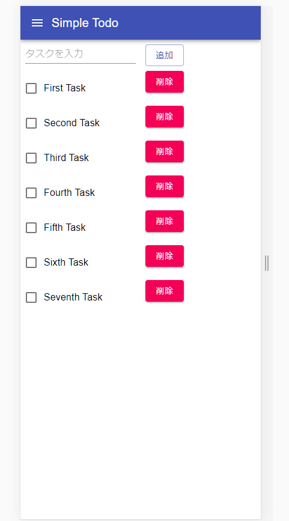

Meteor Framework Samples
===

Node.jsのフルスタックフレームワーク`Meteor`のチュートリアルを動かしてみたサンプルコード。

## Tutorial
[Meteor React Tutorial](https://react-tutorial.meteor.com/simple-todos/01-creating-app.html)

## インストール 
最初に`Meteor`のインストールを行う。Windowsでは`choco`コマンドからのインストールが記載されているが、WSL(WSL2)を使っているなら、macOSやLinuxと同様にシェルスクリプトからのインストールで問題ない。

```sh
curl https://install.meteor.com/ | sh
```

### CLI
インストールができたら、`meteor`のCLIが使えるようになっている。基本的に、プロジェクトの生成・依存関係の解決・ビルド・ローカルサーバーの実行などプロジェクトに必要なコマンドは一通り揃っている。

```sh
(base) ~/W/repositories ❯❯❯ meteor --help
Usage: meteor [--release <release>] [--help] <built-in command> [args]
       meteor help <built-in command>
       meteor [--version] [--arch]
       meteor [run | test | test-packages] --inspect[-brk][=<port>]
       meteor <node | npm | other> [args]


With no arguments, 'meteor' runs the project in the current
directory in local development mode. You can run it from the root
directory of the project or from any subdirectory.

Use 'meteor create <path>' to create a new Meteor project.

Built-in Commands:
   run                           [default] Run this project in local development mode.
   debug                         Run the project with server-side debugging enabled.
   create                        Create a new project.
   update                        Upgrade this project's dependencies to their latest versions.
   add                           Add a package to this project.
   remove                        Remove a package from this project.
   list                          List the packages explicitly used by your project.
   add-platform                  Add a platform to this project.
   remove-platform               Remove a platform from this project.
   list-platforms                List the platforms added to your project.
   ensure-cordova-dependencies   Ensure that Cordova dependencies are installed.
   build                         Build this project for all platforms.
   lint                          Build this project and run the linters printing all errors and warnings.
   shell                         Launch a Node REPL for interactively evaluating server-side code.
   mongo                         Connect to the local Mongo database
   reset                         Reset the project state. Erases the local database.
   deploy                        Deploy this project to Galaxy, Meteor's hosting service.
   authorized                    View or change authorized users and organizations for a site.
   login                         Log in to your Meteor developer account.
   logout                        Log out of your Meteor developer account.
   whoami                        Prints the username of your Meteor developer account.
   test-packages                 Test one or more packages.
   test                          Test the application
   admin                         Administrative commands.
   list-sites                    List sites for which you are authorized. Lists by region, default is us-east-1.
   publish-release               Publish a new meteor release to the package server.
   publish                       Publish a new version of a package to the package server.
   publish-for-arch              Builds an already-published package for a new platform.
   search                        Search through the package server database.
   show                          Show detailed information about a release or package.

See 'meteor help <built-in command>' for details on a command.

Passing '--inspect' or '--inspect-brk' to 'meteor run', 'meteor test', or
'meteor test-packages' will enable debugging of the server process.

Other Commands:

Meteor also bundles 'node' and 'npm' by default. If you use the
commands 'meteor node' or 'meteor npm', you will be running
the same versions of 'node' and 'npm' that Meteor uses internally.

Other commands can be installed in the same directory as 'node' and
'npm' and used in all apps using the same version of Meteor. The
easiest way to install such commands is to add a global npm package
('yarn', 'jsdoc', etc.) that provides the command:

    meteor npm install --global <package name>

Any executable program(s) added by this command can be invoked just
like 'meteor node' or 'meteor npm' (for example, 'meteor yarn'):

    meteor <other command> [args]

Note that you may need to reinstall these commands after updating to
a different version of Meteor.
```

#### プロジェクトの作成

プロジェクトを作成するには、`create`コマンドを実行する。createコマンドでは、空のプロジェクトもできるし、最小限のパッケージのみやフルスタックか選べたり、reactやtypescriptを使う設定で初期化することもできる。標準構成に加えてreactとtypescriptを使うには、次のようにする。

```sh
meteor create　--react --typescript <project-name>
```

#### プロジェクトのビルド

プロジェクトのビルドを行うには作成したプロジェクトのディレクトリで`build`コマンドを実行する。

```sh
cd prject
meteor build .
```

#### ローカルサーバーの実行

プロジェクトのビルドを行うには作成したプロジェクトのディレクトリで`run`コマンドを実行する。デフォルトだとwatchモードで動いているっぽいので、編集ご保存をすると変更を検知して自動で更新をかけてくれる。

```sh
cd prject
meteor run
```

#### npm packageのインストール
npm packageのインストールにも`meteor`を使う。meteorコマンドからnpmコマンドを実行できるので、meteorコマンドからnpmインストールするらしい。[公式サイト](https://guide.meteor.com/v1.3/using-npm-packages.html)では、`meteor`コマンドから`moment`パッケージをインストール手順が示されている。`meteor`を指定する以外は、通常のnpm packageのインストール手順と変わらない。

```sh
meteor npm install --save moment
```

### プロジェクトの編集
- 公式サイトのチュートリアルを参考にしつつ、TypescirptとMaterialUIを導入して実装したコードが[simple-todo](./simple-todo-app)として置いてある。

デスクトップデバイスでの表示


モバイルデバイスでの表示


プロジェクトの編集は通常のnode.jsプロジェクトと変わらない。meteorコマンドからパッケージの依存管理・ビルド・リリースなど一通り行えることフルスタックフレームであることから。結構便利そうではある。