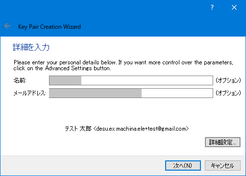
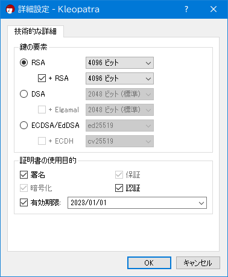
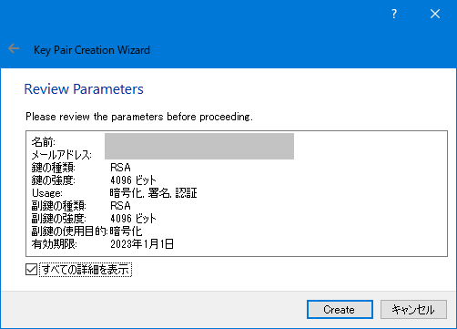
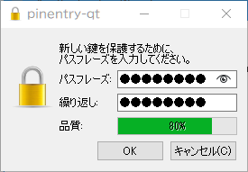
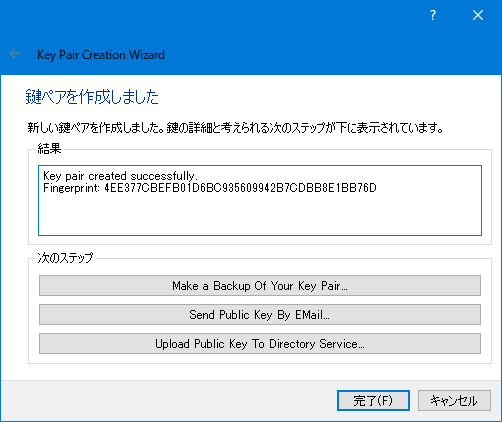
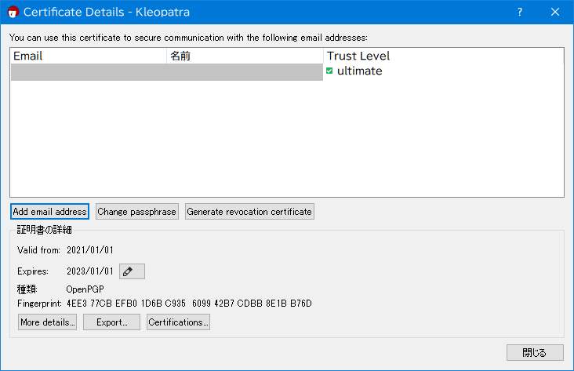
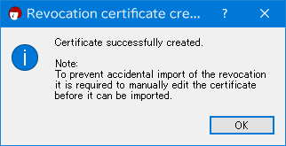

[toc]

GPGの使い方
===

## GPGについて
GPG(Gnu Privacy Guard)とは、PGP規格(RFC4880)に準拠した暗号化ソフトウェアである。GPGを使うことで、データの暗号化や署名の作成・検証ができる。

## 鍵の生成と削除

まず、鍵の各種操作についてまとめる。

### 鍵の生成
鍵ペアを生成するには、`--full-generate-key`コマンドまたは`--generate-key`コマンドを使う。`--full-generate-key`は全機能の鍵を作成できる。通常は、`--generate-key`コマンドを指定すれば十分と思われる。

#### --generate-key コマンド

```sh
 ❯ gpg --gen-key
gpg (GnuPG) 2.2.4; Copyright (C) 2017 Free Software Foundation, Inc.
This is free software: you are free to change and redistribute it.
There is NO WARRANTY, to the extent permitted by law.

注意: 全機能の鍵生成には "gpg --full-generate-key" を使います。

GnuPGはあなたの鍵を識別するためにユーザIDを構成する必要があります。

本名: test tarou
電子メール・アドレス: test@sample.com
次のユーザIDを選択しました:
    "test tarou <test@sample.com>"

名前(N)、電子メール(E)の変更、またはOK(O)か終了(Q)? O
たくさんのランダム・バイトの生成が必要です。キーボードを打つ、マウスを動か
す、ディスクにアクセスするなどの他の操作を素数生成の間に行うことで、乱数生
成器に十分なエントロピーを供給する機会を与えることができます。
たくさんのランダム・バイトの生成が必要です。キーボードを打つ、マウスを動か
す、ディスクにアクセスするなどの他の操作を素数生成の間に行うことで、乱数生
成器に十分なエントロピーを供給する機会を与えることができます。
gpg: 鍵900BA454AA935026を究極的に信用するよう記録しました
gpg: 失効証明書を '/path/to/home/.gnupg/openpgp-revocs.d/5A8548AEC396CD07BE0FAB9F900BA454AA935026.rev' に保管しました。
公開鍵と秘密鍵を作成し、署名しました。

pub   rsa3072 2021-01-01 [SC] [有効期限: 2023-01-01]
      5A8548AEC396CD07BE0FAB9F900BA454AA935026
uid                      test tarou <test@sample.com>
sub   rsa3072 2021-01-01 [E] [有効期限: 2023-01-01]
```

### 鍵の一覧を表示
GPGで管理されている公開鍵と秘密鍵の一覧を表示するには`--list-keys`コマンドおよび`--list-secret-keys`コマンドをそれぞれ使う。


#### --list-keys コマンド

公開鍵の一覧を表示するには、次のように行う。

```sh
 ❯ gpg --list-keys
gpg: 信用データベースの検査
gpg: marginals needed: 3  completes needed: 1  trust model: pgp
gpg: 深さ: 0  有効性:   3  署名:   0  信用: 0-, 0q, 0n, 0m, 0f, 3u
gpg: 次回の信用データベース検査は、2022-12-19です
/path/to/home/.gnupg/pubring.kbx
---------------------------------
uid           [  究極  ] test tarou <test@sample.com>
sub   rsa3072 2021-01-01 [E] [有効期限: 2023-01-01]
```

#### --list-secret-keys コマンド

秘密鍵の一覧を表示するには、次のように行う。

```sh
❯ gpg --list-secret-keys
/path/to/home/.gnupg/pubring.kbx
---------------------------------
uid           [  究極  ] test tarou <test@sample.com>
ssb   rsa3072 2021-01-01 [E] [有効期限: 2023-01-01]
```

### 鍵の削除
GPGで管理されている公開鍵と秘密鍵を削除するには`--delete-key`コマンドおよび`--delete-secret-key`コマンドをそれぞれ使う。鍵の削除は、秘密鍵→公開鍵の順に行う。

#### --delete-secret-key コマンド

秘密鍵を削除するには、鍵IDを指定して次のように行う。

```sh
❯ gpg --delete-secret-key <鍵ID>
```

#### --delete-key コマンド

秘密鍵を削除するには、鍵IDを指定して次のように行う。

```sh
❯ gpg --delete-key <鍵ID>
```

## 鍵の編集
鍵の編集をするには、`--edit-key`コマンドを使用してgpgの対話モードに入って対話的に編集する

### インタラクティブモード
```sh
 ❯ gpg --edit-key <鍵ID>
gpg (GnuPG) 2.2.4; Copyright (C) 2017 Free Software Foundation, Inc.
This is free software: you are free to change and redistribute it.
There is NO WARRANTY, to the extent permitted by law.

秘密鍵が利用できます。

sec  rsa3072/900BA454AA935026
     作成: 2021-01-01  有効期限: 2023-01-01  利用法: SC  
     信用: 究極        有効性: 究極
ssb  rsa3072/8F9B34E49BBDC89E
     作成: 2021-01-01  有効期限: 2023-01-01  利用法: E   
[  究極  ] (1). test tarou <test@sample.com>
gpg> 
```

### helpの表示

```sh
gpg> help

quit        このメニューを終了
save        保存して終了
help        このヘルプを表示
fpr         鍵のフィンガープリントを表示
grip        keygripを表示
list        鍵とユーザIDの一覧
uid         ユーザID Nの選択
key         副鍵Nの選択
check       署名の確認
sign        選択したユーザIDに署名する [* 以下の関連コマンドを参照 ]
lsign       選択したユーザIDにローカルに署名
tsign       選択したユーザIDに信用署名を署名する
nrsign      選択したユーザIDに失効不可の署名をする
adduid      ユーザIDの追加
addphoto    フォトIDの追加
deluid      選択したユーザIDの削除
addkey      副鍵を追加
addcardkey  スマートカードへ鍵の追加
keytocard   鍵をスマートカードへ移動
bkuptocard  バックアップ鍵をスマートカードへ移動
delkey      選択した副鍵の削除
addrevoker  失効鍵の追加
delsig      選択したユーザIDから署名を削除する
expire      鍵または選択した副鍵の有効期限を変更する
primary     選択したユーザIDを主にする
pref        優先指定の一覧 (エキスパート)
showpref    優先指定の一覧 (冗長)
setpref     選択したユーザIDに優先指定リストを設定
keyserver   選択したユーザIDに優先鍵サーバのURLを設定
notation    選択したユーザIDに注釈を設定する
passwd      パスフレーズの変更
trust       所有者信用の変更
revsig      選択したユーザIDの署名を失効
revuid      選択したユーザIDの失効
revkey      鍵の失効または選択した副鍵の失効
enable      鍵を有効にする
disable     鍵を無効にする
showphoto   選択したフォトIDを表示
clean       使えないユーザIDをコンパクトにし、使えない署名を鍵から除去
minimize    使えないユーザIDをコンパクトにし、すべての署名を鍵から除去

* 'sign' コマンドは 'l' で始まると、ローカルの署名で (lsign)、
  't' で始まると信用署名 (tsign)、'nr' で始まると失効不可署名
  (nrsign)、もしくはこれらの組み合わせ (ltsign, tnrsign, など)となります。
```

### パスフレーズの変更

パスフレーズを変更するには、`paswd`コマンドを入力する。

```sh
gpg> passwd

<パスフレーズの変更>
```

### 副鍵の生成
副鍵(Sub key)を生成するには、`addkey`コマンドを使う。副鍵は、主鍵(Master key)から生成した鍵のことで主鍵と同等の認証情報を持っている。一方で、副鍵が漏洩しても 主鍵の情報は漏洩しない。 漏洩した場合には、副鍵のみを無効化し、主鍵から再度新しい副鍵を生成して置き換えることができる。主鍵は、オフラインで保管しておき、普段遣いには副鍵を利用するのが望ましい。

署名のみの機能を持ち4096ビットの鍵長で1年で失効する副鍵を生成するには、対話モードで次のように入力していく。

```sh
gpg> addkey
ご希望の鍵の種類を選択してください:
   (3) DSA (署名のみ)
   (4) RSA (署名のみ)
   (5) Elgamal (暗号化のみ)
   (6) RSA (暗号化のみ)
   (7) DSA (機能をあなた自身で設定)
   (8) RSA (機能をあなた自身で設定)
  (10) ECC (署名のみ)
  (11) ECC (機能をあなた自身で設定)
  (12) ECC (暗号化のみ)
  (13) 既存の鍵
あなたの選択は? 4
RSA 鍵は 1024 から 4096 ビットの長さで可能です。
鍵長は? (3072) 4096
要求された鍵長は4096ビット
鍵の有効期限を指定してください。
         0 = 鍵は無期限
      <n>  = 鍵は n 日間で期限切れ
      <n>w = 鍵は n 週間で期限切れ
      <n>m = 鍵は n か月間で期限切れ
      <n>y = 鍵は n 年間で期限切れ
鍵の有効期間は? (0) 1y
鍵は2022年01月01日 23時53分40秒 JSTで期限切れとなります
これで正しいですか? (y/N) y
本当に作成しますか? (y/N) y
たくさんのランダム・バイトの生成が必要です。キーボードを打つ、マウスを動か
す、ディスクにアクセスするなどの他の操作を素数生成の間に行うことで、乱数生
成器に十分なエントロピーを供給する機会を与えることができます。

sec  rsa3072/900BA454AA935026
     作成: 2021-01-01  有効期限: 2023-01-01  利用法: SC  
     信用: 究極        有効性: 究極
ssb  rsa3072/8F9B34E49BBDC89E
     作成: 2021-01-01  有効期限: 2023-01-01  利用法: E   
ssb  rsa4096/8EDD0CB86568188E
     作成: 2021-01-01  有効期限: 2022-01-01  利用法: S   
[  究極  ] (1). test tarou <test@sample.com>
```


## 鍵のインポート・エクスポート

鍵のインポートとエクスポートをするには、`--import`コマンドおよび`--export`コマンドをそれぞれ使う。

### 鍵のエクスポート

鍵のエクスポートをするには、`--export`コマンドを使う。

```sh
gpg --export <鍵ID> 
```

バイナリではなくASCII形式(テキスト形式)で出力するには`--armor`オプションを一緒に指定する。

```sh
gpg --export --armor <鍵ID> 
```

### 鍵のインポート

鍵のインポートするには、`--import`コマンドを使う。

```sh
gpg --import 鍵ファイルへのパス 
```

### 失効証明書の発行
鍵を紛失または流出、暗号化アルゴリズムの陳腐化などで鍵を無効にしたい場合に備えて、鍵を無効にしたという証明書を用意しておく。これが __失効証明書__ である。失効証明書は間違って、インポートしたりしないように証明書の開始セクション`:-----BEGIN PGP PUBLIC KEY BLOCK-----`がコメントアウト（無効化）されている。そのため、執行証明書を使う場合は、コメントアウトを外してからimportコマンドでインポートする。

```sh
> vim /path/to/revocation-file
秘密鍵のコンプロマイズや紛失の場合、これを使ってこの鍵を失効させます。
しかし、秘密鍵がまだアクセス可能である場合、新しい失効証明書を生成し、
失効の理由をつける方がよいでしょう。詳細は、GnuPGマニュアルのgpgコマンド "--generate-revocation"の記述をご覧ください。

このファイルを誤って使うのを避けるため、以下ではコロンが5つのダッシュ
の前に挿入されます。この失効証明書をインポートして公開する前に、テク
スト・エディタでこのコロンを削除してください。

-----BEGIN PGP PUBLIC KEY BLOCK-----
Comment: This is a revocation certificate

iQG2BCABCgAgFiEEWoVIrsOWzQe+D6ufkAukVKqTUCYFAl/vLXkCHQAACgkQkAuk
VKqTUCZrUgwAzxWvY2JwJC/IJdA2wsZMM/Sf1Eop59b0Qnx0x8uGD35m5dTVTcyl
ePFfMtK7EHPWio+3tqP+BkoPA60631vbcj7n4N+n8m9uGzL/lRnKYYjexhj/XPm4
psVREpuRO5JieL5Fl3VMqHTvg7bVp4D0kjaavEzxSiTmOt37fbPmWePWZnfk37Ea
CSTl75aM6gTpnwH7Fu1Sn/8Bk2BoouDIIC1N6A8MjuUat9x3szqJTWDS5DSPLRs7
dfyLPOZ1vN37ayKpaBaF0BQzah8WWZjkaNWcM59x4Q+tTdV7D8njX7WMjof7jMre
RVLP1sYDqZgjRCVmA4aSX3eRDa+x6bDudkKCvj+EYpxlDDMDC0h7VhVsf3K1Elbs
kU2Tm3dQeLzhV4wQCud2QA3sR/3SLpufD7jzVnHoqr1XC4CjRsweqzwIPNXU16A1
r3nvhpwL4fgyUtCS6K4eTXfHkymdPjbhFJ4L0u5pfDiVkFH2YfYr4Wq9JNHF0yft
s33oDvW4mVg2
=DcPy
-----END PGP PUBLIC KEY BLOCK-----
```

編集したら、`--import`コマンドでインポートする。

```sh
❯ gpg --import 失効証明書のパス
gpg: 鍵900BA454AA935026:"test tarou <test@sample.com>"失効証明書をインポートしました
gpg: 処理数の合計: 1
gpg:    新しい鍵の失効: 1
gpg: marginals needed: 3  completes needed: 1  trust model: pgp
gpg: 深さ: 0  有効性:   3  署名:   0  信用: 0-, 0q, 0n, 0m, 0f, 3u
gpg: 次回の信用データベース検査は、2022-12-19です
```
## 暗号化と復号化

データを暗号化と復号化するには、`--encrypt`コマンドおよび`--decrypt`コマンドをそれぞれ使う。

### データの暗号化

自分のみ復号化できるよう`--recepient`オプションで自分の公開鍵を指定する情報（公開鍵IDやメールアドレスなど）を記述する。

```sh
❯ gpg --encrypt --recipient <自分の公開鍵ID> ファイルへのパス
```

特定の相手のみ復号化できるよう`--recepient`オプションで相手のオプションで自分の公開鍵を指定する情報（公開鍵IDやメールアドレスなど）を記述する。

```sh
❯ gpg --encrypt --recipient <相手の公開鍵ID> ファイルへのパス
```

### データの復号化

自分のみ復号化するには、`--decrypt`コマンドと暗号化ファイルを指定する。

```sh
❯ gpg --decrypt 暗号化ファイルへのパス
```

### 実行例
サンプルとして、`assets/data`に青空文庫で公開されているの坊っちゃんの冒頭部分のテキストを、暗号化して復号化するには次のようにする。

```sh
❯ gpg --encrypt --recipient 5A8548AEC396CD07BE0FAB9F900BA454AA935026 ./assets/data/test-data.txt

❯ gpg --decrypt --recipient 5A8548AEC396CD07BE0FAB9F900BA454AA935026 ./assets/data/test-data.txt.gpg
gpg: 3072-ビットRSA鍵, ID 8F9B34E49BBDC89E, 日付2021-01-01に暗号化されました
      "test tarou <test@sample.com>"
　親譲りの無鉄砲で小供の時から損ばかりしている。小学校に居る時分学校の二階から飛び降りて一週間ほど腰を抜かした事がある。なぜそんな無闇をしたと聞く人があるかも知れぬ。別段深い理由でもない。新築の二階から首を出していたら、同級生の一人が冗談に、いくら威張っても、そこから飛び降りる事は出来まい。弱虫やーい。と囃したからである。小使に負ぶさって帰って来た時、おやじが大きな眼をして二階ぐらいから飛び降りて腰を抜かす奴があるかと云ったから、この次は抜かさずに飛んで見せますと答えた。
　親類のものから西洋製のナイフを貰って奇麗な刃を日に翳して、友達に見せていたら、一人が光る事は光るが切れそうもないと云った。切れぬ事があるか、何でも切ってみせると受け合った。そんなら君の指を切ってみろと注文したから、何だ指ぐらいこの通りだと右の手の親指の甲をはすに切り込んだ。幸ナイフが小さいのと、親指の骨が堅かったので、今だに親指は手に付いている。しかし創痕は死ぬまで消えぬ。
```

## 署名と検証

署名と検証をするには、`--sign`オプションと`--verify`オプションをそれぞれ使う。


### 署名を作成

署名を行うには、`--sign`コマンドと署名対象のファイルを指定する。

```sh
gpg --sign 署名対象のファイルへのパス
```

特定の鍵を指定する場合は、`-u`オプションを使う。

```sh
gpg --sign -u <鍵ID> 署名対象のファイルへのパス
```

### クリアテキスト署名

クリアテキスト署名とは、元のテキストにASCII形式の署名を添付した形になっています。テキストの署名には、こちらを使うことが多いと思われる。 クリアテキスト署名を行うには、`--clear-sign`コマンドと署名対象のファイルを指定する。

```sh
gpg --clear-sign 署名対象のファイルへのパス
```

特定の鍵を指定する場合は、`-u`オプションを使う。

```sh
gpg --clear-sign -u <鍵ID> 署名対象のファイルへのパス
```

クリアテキスト署名は、以下のような形式になる。


```sh
 ❯ cat ./test-data.txt.asc
-----BEGIN PGP SIGNED MESSAGE-----
Hash: SHA512

　親譲りの無鉄砲で小供の時から損ばかりしている。小学校に居る時分学校の二階から飛び降りて一週間ほど腰を抜かした事がある。なぜそんな無闇をしたと聞く人があるかも知れぬ。別段深い理由でもない。新築の二階から首を出していたら、同級生の一人が冗談に、いくら威張っても、そこから飛び降りる事は出来まい。弱虫やーい。と囃したからである。小使に負ぶさって帰って来た時、おやじが大きな眼をして二階ぐらいから飛び降りて腰を抜かす奴があるかと云ったから、この次は抜かさずに飛んで見せますと答えた。
　親類のものから西洋製のナイフを貰って奇麗な刃を日に翳して、友達に見せていたら、一人が光る事は光るが切れそうもないと云った。切れぬ事があるか、何でも切ってみせると受け合った。そんなら君の指を切ってみろと注文したから、何だ指ぐらいこの通りだと右の手の親指の甲をはすに切り込んだ。幸ナイフが小さいのと、親指の骨が堅かったので、今だに親指は手に付いている。しかし創痕は死ぬまで消えぬ。
-----BEGIN PGP SIGNATURE-----

iQIzBAEBCgAdFiEEljwxqWHZNjcXwfhCjt0MuGVoGI4FAl/vSNcACgkQjt0MuGVo
GI5Izg//dooq0056Zk7WAMK63xl4CCmFPFnIKHDsdDnuBLPimNuxMrKc3lerrfB4
0IVquzIUDX/p10HMm+0LAs4DYPkdwIoz4i0v0gyDdL3BLDW6EyHYTYNB+YjVMgLJ
fmELROcoUAAQov9v8zPq37zKIZDuGGCsR2s870aMr/rG/2taJ0GD8DggVJCUIXAK
TTHVO4nG+qGoT2Fjz8TtsH/eJwuhbHYmbLtOenk/n7SbhR61FnDUnFTPlstutDb4
loaeQul3FlQp6gPCONeV4p9pOgRE15PH/pzP6uvX9xCQ3+QHBdN6BJ289cXkcNqp
J0TaqYasvCyBo4PHbTJtJGq+cDXRJMTm4K8kpeNBVSBH2hZO9GuW48jvJDtVw7de
ydO3/5g6AeX+LbsEE+EW6TZLS1rToEbNkBleZS5lsBdpY4HAzGIiLvlQ8U+1uskb
9sNsB3HCgA2Xh5sWGwggq/X64DIKX5e1x49vMk1QEmRxzchJswtc7zksfu2gx81a
Bxvk/bKKHaPeCgUJDgMP7n/V59GKr8AzRI6d3k8LcWn0cAnDqQoimkwhuDz6Hv0q
ib6i+7X5yWzCh/I9Hpc83lj6S/2SP1dnkATuYput9TS1stmwLGSjvlMMlEY5TBmg
ZAJXz/LfUT544rwc8DRk16sD02Eb4SzmpYVoZVE6TRYdNGswc6w=
=2yMR
-----END PGP SIGNATURE-----
```

### 署名の検証
署名の検証には、`--verify`コマンドを使う。

```sh
gpg --verify 署名ファイルへのパス
```
### 署名と検証の実行例
サンプルとして、`assets/data`に青空文庫で公開されているの坊っちゃんの冒頭部分のテキストに署名して検証するには次のようにする。

```sh
❯ gpg --clear-sign -u 5A8548AEC396CD07BE0FAB9F900BA454AA935026 ./assets/data/test-data.txt
❯ gpg --verify -u 5A8548AEC396CD07BE0FAB9F900BA454AA935026 ./test-data.txt.asc
gpg: 2021年01月02日 01時07分51秒 JSTに施された署名
gpg:                RSA鍵963C31A961D9363717C1F8428EDD0CB86568188Eを使用
gpg: "test tarou <test@sample.com>"からの正しい署名 [究極]
gpg: *警告*: 分遣署名ではありません。ファイル「./test-data.txt」は検証され*ませんでした*!
```

## GPG4Winの使い方 

ほとんどgpgコマンドから作業することになるが、GUIが分かりづらいので備忘録的にGPG4Winの使い方を載せておく。

### 鍵ペアの作成

Kleopatraを起動して、ファイルメニューからNew Key Pairを選ぶ

ユーザ情報の設定する。



必要に応じて、詳細設定ボタンから鍵の種類や鍵長などの指定をする。



OKボタンを押して鍵パラメータを確認する。



鍵のパスフレーズを入力する。



鍵が作成されたことを確認する。必要に応じて、公開鍵サーバーへの登録などを行う。



### 失効証明書の発行
鍵を選び、詳細からGenerate revocation certificateを選ぶ。






